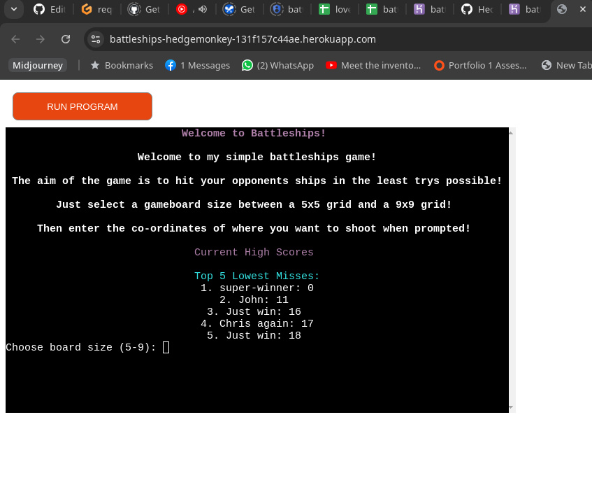
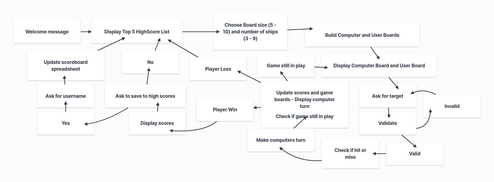

# [Battleship Game](https://battleships-hedgemonkey-131f157c44ae.herokuapp.com/ "Click to see deployed app")

This is a simple command-line Battleship game written in Python, with a leader board stored in a google docs spreadsheet.

## Contents

Click here for Table of Contents

[Screenshots](#screenshots)

[Flow Chart Screenshots](#flow-chart-screenshots)

[Features](#features)

[Testing](#testing)

[Future](#future)

[Deployment](#deployment)

[Credits](#credits)

## Screenshots
| Heroku Deployed App |
| :---: |
|  |
| This is the app showing the Welcome screenwith Leaderboard with scores sourced through Google Docs API |

## Flow Chart Screenshots
| Flow Chart Screenshot |
| :---: |
|  |
| This is a rough flow chart displaying the program processes made using [Milanote](https://milanote.com/)

[Back to top](#contents)

## Features
* **Player vs. Computer:** Play against a challenging AI opponent.
* **Multiple Board Sizes:** Choose a board size between 5x5 and 9x9.
* **High Scores:**  Track your best scores and compare them to others.
* **Colorful Interface:**  Enjoy a visually enhanced gameplay experience with colored console output.
* **Leaderboard:** Top scores saved to a Google sheets leaderboard using `Google Docs API` and `gspread`
  
[Back to top](#contents)

## Testing
### Replit
Most of this project was developed using Replit and so testing was done as I was building the project step by step

[Back to top](#contents)

## Future
### Potential Future Features
* **Player vs. Player:** Perhaps add functionality to allow for a 2 player turn-based mode
* **Various Ship Sizes:** It would be nice to add different dized ships more akin to traditional Battleships game, with a choice of orientation
* **Number of Ships:** The added functionality to not only choose the board size but to also choose how many ships on the board would also be an attractive addition to the game
* **Choose Ship Placement:** The option to decide where you would like to place your ships on the board would also be a nice future feature to incorporate

[Back to top](#contents)

## Deployment
The site was deployed to Heroku. The steps to deploy are as follows:

- Set up a [Heroku](https://dashboard.heroku.com) Account and create a new App
- In Settings add the python and nodejs buildpacks
- In `Settings > Config Vars` Add the creds.json contents under the variable `CREDS`
- Link the [GitHub repository](https://github.com/hedgemonkey/battleships) to the Heroku app.

Heroku git URL
[https://git.heroku.com/battleships-hedgemonkey.git]

The live link can be found [here](https://battleships-hedgemonkey-131f157c44ae.herokuapp.com/)

[Back to top](#contents)

### Google Docs
This project uses a `Google Sheets` spreadsheet hosted on `Google Docs` accessed by `Google Cloud API` this is to keep track of past scores.

In order to deploy this yourself you would have to get the correct credentials to access this file or specify your own spreadsheet and provide your own Google Cloud API Credentials

To do this you ned to save your own credentials to `creds.json` and change the line `SHEET = GSPREAD_CLIENT.open('battleship_scores').sheet1` replacing `battleship_scores` with your own spreadsheet filename

The spreadsheet can be access [HERE](https://docs.google.com/spreadsheets/d/1cUhnYhy8DuxIEW6_BLnj0OFL38dNoRqmyVvkgnQDai8/edit?usp=sharing)

[Back to top](#contents)

### Local Deployment

You can clone or fork this project to make a local copy on your system.

[Back to top](#contents)

#### Cloning

You can clone the repository by following these steps:

1. Go to the [GitHub repository](https://github.com/Hedgemonkey/battleships).
2. Locate the Code button above the list of files and click it.
3. Select if you prefer to clone using HTTPS, SSH, or GitHub CLI and click the copy button to copy the URL to your clipboard.
4. Open Git Bash or Terminal.
5. Change the current working directory to the one where you want the cloned directory.
6. In your IDE Terminal, type the following command to clone my repository:
    - `git clone https://github.com/hedgemonkey/battleships.git`
7. Press Enter to create your local clone.

[Back to top](#contents)

#### Forking

By forking the GitHub Repository, we make a copy of the original repository on our GitHub account to view and/or make changes without affecting the original owner's repository.
You can fork this repository by using the following steps:

1. Log in to GitHub and locate the [GitHub repository](https://github.com/Hedgemonkey/battleships).
2. At the top of the Repository (not the top of the page) just above the "Settings" Button on the menu, locate the "Fork" Button.
3. Once clicked, you should now have a copy of the original repository in your own GitHub account.

[Back to top](#contents)

### Local vs Deployment

There are no notable differences between my locally developed app and the Heroku deployed site aside from slight variances in the terminal colours.

[Back to top](#contents)

## Credits 

In this section, I will reference the sources of my content and media, full disclosure of any resources used shall be detailed here.

- Milanote used to create Flow Chart Diagram

- Gemini Pro AI Used to help guide me when code wasn't doing as I intended

[Back to top](#contents)

### Content 

[Back to top](#contents)

### Acknowledgements

- I would like to thank the [Code Institute Slack community](https://code-institute-room.slack.com) for the moral support and general information that helps with my studies.
- I would like to also thank Gemini Pro AI for assisting me whenever I needed a bit of quick advice, although it's suggestions often lead to more complications it's explinations and tips were incredibly helpful
- YTMusic for providing me with a soundtrack to work to

[Back to top](#contents)